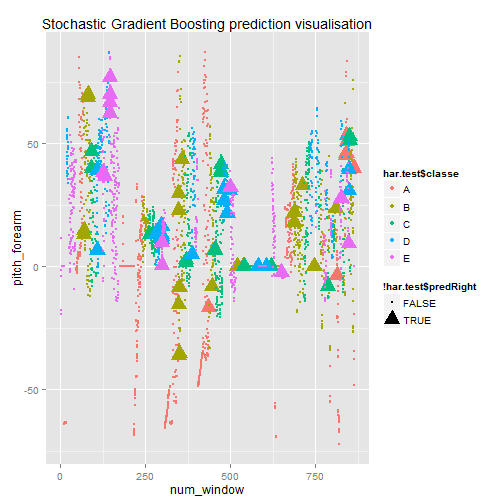

##Human Activity Recognition - Weight Lifting Exercises
**Overview**
This Write up presents the analysis of Weight Lifting Exercises from the HAR project.

Let's first load the file and do some cleaning.


```r
library(caret)
```

```
## Loading required package: lattice
## Loading required package: ggplot2
```

```r
har<-read.csv("pml-training.csv");
```

We will drop all variables before num_window

```r
har1<-har[,7:ncol(har)];
```

Then repair broken import. Some numeric variables were imported as Factors. Let's change it to num

```r
classes <- lapply(har1,class)
for (i in 1:(ncol(har1)-1)) { if (classes[i]=="factor") {har1[,i]=as.numeric(as.character(har1[,i])) }}
```

The learning process and tuning will be done using traninng data with reapered K-fold crossvalidation. This will give initial evaluation of accuracy. To further test the accracy completely out of sample we will use labelled test data. The split will be 80% to 20%.

```r
inTrain<-createDataPartition(y=har$classe,p=0.8,list=FALSE)
har.train<-har1[inTrain,]
har.test<-har1[-inTrain,]
```

We will also test the variables for missing values. If a variable has more that 97% NAs we will not use it the analysis.

```r
missingCnt<-vector(mode = "logical", length = ncol(har.train))
for (i in 1:ncol(har.train)) { missingCnt[i]<-length(which(is.na(har.train[,i]))) }
missingPrc = missingCnt/nrow(har.train)
har.train<-subset(har.train,,missingPrc<0.97)
har.test<-subset(har.test,,missingPrc<0.97)
```

Let's do a quick overview of Machine Learing methods. We will test Support Vector Machines, Random Forrests and Stochastic Gradient Boosting each with or without PCA. This will be done on a very small sample to evaluate accuracy and speed.


```r
set.seed(11);
har.train<-har.train[sample(nrow(har.train)),];

har.trainsmall <- har.train[1:750,];

ctrl <- trainControl(method = "repeatedcv",number=5, repeats=3)
```

```r
#Support Vector Machines
pt<-proc.time()
modSvm <- train(classe~.,method="svmLinear",data=har.trainsmall,trControl=ctrl)
```

```
## Loading required package: kernlab
```

```r
proc.time()-pt
```

```
##    user  system elapsed 
##   10.25    0.53    3.61
```

```r
#Support Vector Machines with PCA
pt<-proc.time()
modSvmPCA <- train(classe~.,method="svmLinear",data=har.trainsmall,trControl=ctrl,preProcess=c("pca"))
proc.time()-pt
```

```
##    user  system elapsed 
##   10.67    0.91    3.00
```

```r
#Random Forrests
pt<-proc.time()
modRf <- train(classe~.,method="rf",data=har.trainsmall,trControl=ctrl,importance = TRUE)
```

```
## Loading required package: randomForest
## randomForest 4.6-10
## Type rfNews() to see new features/changes/bug fixes.
```

```r
proc.time()-pt
```

```
##    user  system elapsed 
##   91.31    0.15   90.93
```

```r
#Random Forrests with PCA
pt<-proc.time()
modRfPCA <- train(classe~.,method="rf",data=har.trainsmall,trControl=ctrl,importance = TRUE,preProcess=c("pca"))
proc.time()-pt
```

```
##    user  system elapsed 
##  106.02    5.04   64.46
```

```r
#Stochastic Gradient Boosting
pt<-proc.time()
modGbm <- train(classe~.,method="gbm",data=har.trainsmall,trControl=ctrl, verbose=FALSE)
```

```
## Loading required package: gbm
## Loading required package: survival
## Loading required package: splines
## 
## Attaching package: 'survival'
## 
## The following object is masked from 'package:caret':
## 
##     cluster
## 
## Loading required package: parallel
## Loaded gbm 2.1
## Loading required package: plyr
```

```r
proc.time()-pt
```

```
##    user  system elapsed 
##   39.36    0.09   39.48
```

```r
#Stochastic Gradient Boosting with PCA
pt<-proc.time()
modGbmPCA <- train(classe~.,method="gbm",data=har.trainsmall,trControl=ctrl, verbose=FALSE,preProcess=c("pca") )
proc.time()-pt
```

```
##    user  system elapsed 
##   72.13    4.87   27.55
```
Let's see the results:

```r
results <- resamples(list(SVM=modSvm,SVM_PCA=modSvmPCA, RF=modRf,RF_PCA=modRfPCA, GBM=modGbm, GBM_PCA=modGbmPCA));
summary(results);
```

```
## 
## Call:
## summary.resamples(object = results)
## 
## Models: SVM, SVM_PCA, RF, RF_PCA, GBM, GBM_PCA 
## Number of resamples: 15 
## 
## Accuracy 
##           Min. 1st Qu. Median   Mean 3rd Qu.   Max. NA's
## SVM     0.6093  0.6822 0.7133 0.6982  0.7242 0.7400    0
## SVM_PCA 0.4933  0.5083 0.5302 0.5351  0.5515 0.6200    0
## RF      0.8600  0.8691 0.8867 0.8893  0.8997 0.9333    0
## RF_PCA  0.6533  0.7143 0.7315 0.7315  0.7508 0.8133    0
## GBM     0.7919  0.8595 0.8733 0.8671  0.8767 0.9139    0
## GBM_PCA 0.5867  0.6337 0.6443 0.6440  0.6555 0.6887    0
## 
## Kappa 
##           Min. 1st Qu. Median   Mean 3rd Qu.   Max. NA's
## SVM     0.5026  0.5931 0.6299 0.6140  0.6496 0.6659    0
## SVM_PCA 0.3511  0.3743 0.4016 0.4070  0.4283 0.5088    0
## RF      0.8213  0.8334 0.8559 0.8592  0.8727 0.9153    0
## RF_PCA  0.5522  0.6350 0.6568 0.6570  0.6823 0.7611    0
## GBM     0.7354  0.8214 0.8382 0.8309  0.8432 0.8904    0
## GBM_PCA 0.4733  0.5328 0.5459 0.5466  0.5604 0.6053    0
```

Random Forrest is a winner in terms of Accuracy but it takes around twice as long as Stochastic Gradient Boosting which has only a slightly lower accuracy. Support Vector Machines algorithm is a lot faster but the accuracy is a lot lower. 
Using PCA speeds up the analysis but worsens the accuracy.

We will use GBM algorithm without PCA. 
(I admit. I've started it to late, and it's almost deadline. Thus I will a smaller random sample of N=5000.)

```r
#Stochastic Gradient Boosting
har.trainsmall <- har.train[1:5000,];
pt<-proc.time()
modGbm <- train(classe~.,method="gbm",data=har.trainsmall,trControl=ctrl, verbose=FALSE)
proc.time()-pt
```

```
##    user  system elapsed 
##  255.95    0.61  256.72
```
The output below will give us an estimate of out of sample accuracy.

```r
modGbm
```

```
## Stochastic Gradient Boosting 
## 
## 5000 samples
##   53 predictor
##    5 classes: 'A', 'B', 'C', 'D', 'E' 
## 
## No pre-processing
## Resampling: Cross-Validated (5 fold, repeated 3 times) 
## 
## Summary of sample sizes: 4000, 4000, 4000, 4000, 4000, 4000, ... 
## 
## Resampling results across tuning parameters:
## 
##   interaction.depth  n.trees  Accuracy   Kappa      Accuracy SD
##   1                   50      0.7676662  0.7059957  0.011306712
##   1                  100      0.8282665  0.7830147  0.009432496
##   1                  150      0.8616670  0.8252347  0.008306872
##   2                   50      0.8764000  0.8437685  0.008330039
##   2                  100      0.9251998  0.9054941  0.007768338
##   2                  150      0.9499341  0.9367536  0.007159736
##   3                   50      0.9210000  0.9001535  0.011345018
##   3                  100      0.9578677  0.9467672  0.008038026
##   3                  150      0.9725347  0.9653058  0.006572061
##   Kappa SD   
##   0.014514420
##   0.012006447
##   0.010483691
##   0.010558377
##   0.009798547
##   0.009038184
##   0.014337535
##   0.010152129
##   0.008298772
## 
## Tuning parameter 'shrinkage' was held constant at a value of 0.1
## Accuracy was used to select the optimal model using  the largest value.
## The final values used for the model were n.trees = 150,
##  interaction.depth = 3 and shrinkage = 0.1.
```

Let's now check accuracy on the labelled test set. This will be the true estimation of the out of sample accuracy as no part of this data was used to tune the model.

```r
predGbm <- predict(modGbm,har.test)
confusionMatrix(predGbm,har.test$classe)
```

```
## Confusion Matrix and Statistics
## 
##           Reference
## Prediction    A    B    C    D    E
##          A 1109   15    0    2    0
##          B    2  738   18    7    3
##          C    0    4  660    8    4
##          D    5    1    5  623    8
##          E    0    1    1    3  706
## 
## Overall Statistics
##                                           
##                Accuracy : 0.9778          
##                  95% CI : (0.9727, 0.9822)
##     No Information Rate : 0.2845          
##     P-Value [Acc > NIR] : < 2.2e-16       
##                                           
##                   Kappa : 0.9719          
##  Mcnemar's Test P-Value : NA              
## 
## Statistics by Class:
## 
##                      Class: A Class: B Class: C Class: D Class: E
## Sensitivity            0.9937   0.9723   0.9649   0.9689   0.9792
## Specificity            0.9939   0.9905   0.9951   0.9942   0.9984
## Pos Pred Value         0.9849   0.9609   0.9763   0.9704   0.9930
## Neg Pred Value         0.9975   0.9933   0.9926   0.9939   0.9953
## Prevalence             0.2845   0.1935   0.1744   0.1639   0.1838
## Detection Rate         0.2827   0.1881   0.1682   0.1588   0.1800
## Detection Prevalence   0.2870   0.1958   0.1723   0.1637   0.1812
## Balanced Accuracy      0.9938   0.9814   0.9800   0.9816   0.9888
```

and visialize data showing the most important variables:


 

Let's try our results on the 20 cases from the Submission test file:

```r
test<-read.csv("pml-testing.csv");

# drop all variables before num_window
test<-test[,7:ncol(har)];

#repair broken import Factors to Num.
for (i in 1:(ncol(test)-1)) { if (classes[i]=="factor") {test[,i]=as.numeric(as.character(test[,i])) }}

test<-subset(test,,missingPrc<0.97)
testpredRf <- predict(modGbm,test)
testpredRf
```

```
##  [1] B A B A A E D B A A B C B A E E A B B B
## Levels: A B C D E
```

